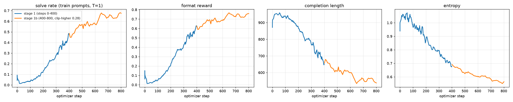

# GRPO Puzzles — RL with verifiable rewards on a 0.8B base model

**Headline (Countdown):** `Qwen/Qwen3.5-0.8B-Base` — no SFT, no chat template, no reference model — trained with
GRPO for 800 optimizer steps on 3-number Countdown puzzles goes from **0% to 40.2%** on 500 held-out puzzles
(**63.9%** on 3-number puzzles, **15.5%** on 4-number puzzles it never trained on). Cost: about 9 A100-hours on
Colab Pro, across many 60-minute VM reclaims.

Everything needed to reproduce it is here: data + prompt, reward function with self-tests, TRL trainer, before/after
eval, the W&B history, the eval JSONs with samples, and a log of what went wrong along the way.

| | `countdown/` | `wordmaze/` |
|---|---|---|
| Task | Use `[44, 19, 35]` once each with `+ - * /` to make `98` | Word ladder in exactly N one-letter moves whose letter-direction pattern spells a password |
| Data | [`Jiayi-Pan/Countdown-Tasks-3to4`](https://huggingface.co/datasets/Jiayi-Pan/Countdown-Tasks-3to4) (490k puzzles) | [`immortal3/wordmaze`](https://dipkumar.dev/posts/llm/wordmaze) |
| Model | `Qwen3.5-0.8B-Base`, full fine-tune | `Qwen3.5-4B` instruct + LoRA (planned) |
| Reward | format 0 / 0.5 / 1 + correct equation 0 / 1 | 10 boolean checks, shaped 0.1 / 0.3 / 1.0 against the known reward hack |
| Status | **trained + evaluated** (below) | code, verifier and reward written and CPU smoke-tested; **no GPU run yet** |

Stack: `trl==1.12.0`, `transformers==5.16.1`, `vllm==0.27.1` (Sep 2026). Prior art for Countdown:
[TinyZero](https://github.com/Jiayi-Pan/TinyZero) (Qwen2.5-3B, veRL) and
[Mini-R1](https://www.philschmid.de/mini-deepseek-r1) (3B-Instruct, TRL). This repo re-does the recipe on a
4× smaller 2026 base model with a hybrid Gated-DeltaNet architecture, which brought its own problems (see gotchas).

---

## Countdown: results

Held-out eval: the same 500 puzzles for every row, never seen in training, raw 3+4-number mix, greedy decoding,
1024 new tokens. "Solve" means the `<answer>` equation uses each number exactly once and evaluates to the target.

| model | solve (mix) | 3-number | 4-number (never trained) | clean format | mean tokens |
|---|---|---|---|---|---|
| base | 0.000 | 0.000 | 0.000 | 0.012 | 1015 |
| GRPO step 400 | 0.318 | 0.533 | 0.094 | 0.366 | 765 |
| **GRPO step 800** | **0.402** | **0.639** | **0.155** | 0.468 | 692 |

pass@8 (T=1, 200 puzzles, 1024 tokens): base **0.070** → GRPO step 400 **0.550**. Raw numbers and 20 samples per
row are in [`countdown/results/*.json`](countdown/results/).

Two honesty notes. Each training prompt was seen about once (8 prompts × 800 steps = 6.4k of 240k puzzles), and
held-out 3-number accuracy (63.9%) matches the training-prompt rate (~65%), so this is not memorization. The
step-800 row was evaluated on an M1 Pro in fp32 with reference kernels because Colab compute units ran out; the
other rows are bf16 through vLLM. pass@8 for step 800 was not run for the same reason.

### Training curves



Stage 1 (blue): 400 steps from the base model. Stage 1b (orange): resumed to 800 with DAPO clip-higher
(ε_high = 0.28). Training-prompt solve rate (T=1 samples): 3% → 41% at step 400 → plateau at ~65% from step 600.
The order of events is the one TinyZero and Mini-R1 describe: the format reward is learned first, completion
length falls (943 → 550 tokens, i.e. the model learns to stop), then the answer reward climbs. Fraction of
"dead" groups (all 16 completions with the same reward, hence zero gradient) fell from 55% to 5%. Entropy 1.05 → 0.57.

Public W&B project: https://wandb.ai/vineethveligeti-asu/grpo-countdown
(runs `cd08b-3only-g16-vllm` = stage 1, `cd08b-3only-s1b` = stage 1b). Exported history:
[`countdown/results/wandb_history_stage1_and_1b.csv`](countdown/results/wandb_history_stage1_and_1b.csv).

### Same puzzle, before and after

Puzzle: numbers `[67, 69, 69]`, target `71`. Both completions are greedy.

**Base model** (hits the 1024-token limit, no answer):

```
We are given numbers: 67, 69, 69. We need to create an equation that equals 71. ...
Let's think: 67 + 69 = 136, too big. 67 - 69 = -2, not good. 69 - 69 = 0. 67 * 69 = 4623, too big.
67 / 69 = 0.970..., not 71. 69 / 69 = 1. 67 + 69 + 69 = 205. 67 - 69 - 69 = -99.
67 * 69 - 69 = 4623 - 69 = 4554. 67 * 69 + 69 = 4623 + 69 = 4692. 67 * 69 / 69 = 67.
67 / 69 + 69 = 67/69 + 69 = 67/69 + 69 = 67/69 + 69 = 67/69 + 69 = 67/69 + 69 = 67/69 + 69 = ...
```

**GRPO step 800** (solved in ~150 tokens):

```
Okay, let's see. The user wants an equation using the numbers 67, 69, and 69 that equals 71. Each number
can be used once. Hmm, I need to think of combinations of these numbers.

First, maybe subtracting 69 from 67? 67 minus 69 is -2, which isn't 71. Not helpful. What about adding 69
and 69? That's 138, way too big. Maybe 67 plus 69? 67 + 69 is 136. Still not 71.

Wait, maybe using subtraction first. 69 minus 67 is 2. Then 2 plus 69 is 71. Oh, that works! So
69 - 67 + 69 equals 71. Let me check: 69 - 67 is 2, then 2 + 69 is 71. Yep, that's correct. Each number
is used once. So the equation is 69 - 67 + 69.
</think>

<answer> 69 - 67 + 69 </answer>
```

Nothing in the prompt or reward asks for "Let me check". The reward only says whether the final equation is right.

### The recipe

- **Prompt:** the TinyZero base-model template verbatim, ending in `<think>` so the completion starts inside
  the think block ([`countdown/data.py`](countdown/data.py)).
- **Rewards** ([`countdown/rewards.py`](countdown/rewards.py), `python rewards.py` runs 11 self-tests):
  `format_reward` = 1 for `</think>` then a single well-formed `<answer>`, 0.5 with trailing junk, 0 otherwise;
  `answer_reward` = 1 iff the equation uses only the given numbers, each exactly once, only `+ - * / ( )`,
  and evaluates to the target within 1e-6. `eval` runs on a character-whitelisted string only.
- **GRPO** (TRL 1.12 `GRPOTrainer`, defaults unless stated): 16 completions per prompt, 8 prompts per optimizer
  step (128 completions), lr 1e-6, β = 0 (no reference model), temperature 1.0, DAPO loss with group-normalised
  advantages, max completion 1024 tokens, colocated vLLM generation.
- **Curriculum:** 3-number puzzles only. The base model's pass@8 on the raw mix was 2.5% at 512 tokens, which
  leaves GRPO almost nothing to push on (most groups have identical rewards). The 4-number column in the results
  table is therefore pure transfer.
- **Stage 1b:** resume from step 400 to 800 with `--epsilon_high 0.28` (DAPO clip-higher), no gradient
  checkpointing, generation batch 1024, vLLM memory 0.45. About 13 s per optimizer step versus 31 s in stage 1.

### What did not work, and what it cost

- **Colab reclaims CLI-created A100 VMs after 60 minutes.** Stage 1 alone took 7 sessions. Fix in the repo:
  every 50-step checkpoint is pushed to a Hub repo, `--resume auto` picks it up, and
  [`supervise.sh`](countdown/supervise.sh) recreates the session and relaunches from the laptop. The W&B run
  continues across VMs via `WANDB_RESUME=allow`.
- **TRL + vLLM cannot load Qwen3.5 text-only from the Hub checkpoint** (TRL #5269). Workaround:
  [`make_text_only_ckpt.py`](countdown/make_text_only_ckpt.py) rewrites the config so vLLM instantiates the
  text-only class. Result: 15.4k tok/s decode versus ~1.6k for HF `generate`, and 7.7 s per 32 completions
  instead of 52 s.
- **Micro-batch 8 OOMs on 40 GB** even with Liger, because the loss-time logits tensor is
  batch × 1024 × 248,320. Micro-batch 4 × 32 accumulation is the setting. Liger at batch 8 was also slower (18 s vs 12 s).
- **Plateau at ~65%** on training prompts from step 600. At step 400, 40% of greedy held-out completions still
  hit the 1024-token limit. Not yet tried: longer completions, 4-number curriculum after 3-number, a larger base.
- Cost: roughly 4.5 A100-hours for stage 1, 4.5 for stage 1b, plus evals. All on Colab Pro compute units.

The full lab notebook with timings, dead ends and dates is [`PROGRESS.md`](PROGRESS.md).

---

## Reproduce

```bash
pip install -U "trl>=1.11" "transformers>=5.2" datasets peft accelerate wandb matplotlib
pip install flash-linear-attention      # Qwen3.5 Gated-DeltaNet kernels (import name: fla) — see gotcha 2
pip install "vllm==0.27.1"; pip uninstall -y torchaudio torchcodec   # optional but 5x faster — see gotcha 3
cd countdown
python rewards.py                                                    # self-tests -> ALL PASS
python make_text_only_ckpt.py Qwen/Qwen3.5-0.8B-Base /content/qwen3.5-0.8b-text   # only needed with --use_vllm
```

Baseline, training (stage 1 and 1b), and after-eval, as run:

```bash
# before: 0% greedy, 7% pass@8
python eval_countdown.py --vllm --model /content/qwen3.5-0.8b-text --tag base-greedy-1024 --max_new_tokens 1024
python eval_countdown.py --vllm --model /content/qwen3.5-0.8b-text --tag base-pass8-1024  --max_new_tokens 1024 --sample --k 8 --n 200

# stage 1: 400 steps (~4.5 A100-hours)
python train_countdown_grpo.py --model /content/qwen3.5-0.8b-text --curriculum 3only --max_steps 400 \
  --max_completion_length 1024 --num_generations 16 --generation_batch_size 512 \
  --per_device_train_batch_size 4 --grad_accum 32 --use_vllm --vllm_gpu_memory_utilization 0.35 \
  --save_steps 50 --report_to wandb --run_name cd-0.8b-3only

# stage 1b: resume to 800 with clip-higher
python train_countdown_grpo.py ... --max_steps 800 --resume auto --epsilon_high 0.28 --no_grad_ckpt \
  --generation_batch_size 1024 --vllm_gpu_memory_utilization 0.45

# after
python eval_countdown.py --vllm --model runs/countdown-qwen3.5-0.8b-base/final --tag grpo800-greedy-1024 --max_new_tokens 1024
python plot_curves.py    # results/curves_grpo800.png from the exported W&B history
```

`--hub_repo <you>/<name>` pushes every checkpoint to the Hub so a killed VM can resume; `supervise.sh` automates
the Colab CLI loop. `eval_countdown.py` falls back to HF `generate` (CUDA, MPS or CPU) without `--vllm`.
There is also a self-contained Colab notebook, [`countdown/countdown_grpo_colab.ipynb`](countdown/countdown_grpo_colab.ipynb),
generated by `build_colab_notebook.py`. Step-by-step guide with the reasoning behind every default:
[`countdown/GUIDE.md`](countdown/GUIDE.md).

GPU: an A100 40 GB is comfortable. L4 (24 GB) works with `--per_device_train_batch_size 4 --grad_accum 8` at 512
tokens, or `--lora`. T4 has no bf16.

## Files

```
├── README.md
├── PROGRESS.md               <- dated lab notebook: every run, timing, dead end
├── GUIDE.html                <- visual companion: GRPO loop, reward trees, expected curves
├── LICENSE                   <- MIT
├── requirements.txt
├── countdown/
│   ├── GUIDE.md              <- step-by-step, with sources
│   ├── data.py               <- dataset + TinyZero base prompt + 500-puzzle held-out split
│   ├── rewards.py            <- format_reward + answer_reward   (python rewards.py -> self-test)
│   ├── train_countdown_grpo.py
│   ├── eval_countdown.py     <- solve rate / pass@k on the held-out split, vLLM or HF generate
│   ├── make_text_only_ckpt.py  <- vLLM-loadable Qwen3.5 text-only checkpoint (TRL #5269 workaround)
│   ├── setup_vm.sh, colab_cli.sh, supervise.sh, eval_all.sh, eval_800.sh, timing_matrix.sh
│   ├── build_colab_notebook.py, countdown_grpo_colab.ipynb
│   ├── plot_curves.py
│   └── results/              <- eval JSONs (metrics + samples), W&B history CSVs, curves
└── wordmaze/
    ├── GUIDE.md
    ├── data.py               <- dataset + chat/base prompts + spelled-out-letters ablation
    ├── verifier.py           <- the 10 checks, 2 dictionaries   (python verifier.py -> self-test)
    ├── rewards.py            <- format 0.1 + valid-ladder 0.3 + solve 1.0
    ├── train_wordmaze_grpo.py
    ├── eval_wordmaze.py      <- per-check table, per (length, moves) bucket
    └── wordmaze_grpo_colab.ipynb
```

## Five Qwen3.5 gotchas (all hit in practice, Sep 2026)

1. **It's a vision-language checkpoint.** `Qwen/Qwen3.5-0.8B-Base` has `architectures: ["Qwen3_5ForConditionalGeneration"]`
   and a vision tower. Load it with `AutoModelForCausalLM` → transformers resolves `qwen3_5` to
   `Qwen3_5ForCausalLM` (text-only, vision weights skipped). If you instead pass the model *name* string to
   `GRPOTrainer`, TRL follows `config.architectures[0]`, loads the full VLM + `AutoProcessor`, treats it as a
   VLM, and defaults the dtype to **float32**. The scripts here instantiate the model themselves in bf16.
2. **Hybrid linear attention needs kernels.** 18 of 24 layers are Gated DeltaNet. Without the `fla` package
   transformers falls back to a slow, memory-hungry PyTorch path — silently in 5.16; 5.17 logs
   `chunk_gated_delta_rule is falling back to its reference PyTorch implementation`. Check explicitly:
   `python -c "from fla.ops.gated_delta_rule import chunk_gated_delta_rule; print('fla OK')"`.
   `causal-conv1d` is a second, minor kernel (a depthwise conv of width 4) that often fails to build on Colab;
   each kernel falls back independently, so skipping it costs very little.
3. **TRL + vLLM + Qwen3.5 text-only is broken in vllm 0.27.1, with a 2-minute workaround**
   ([TRL #5269](https://github.com/huggingface/trl/issues/5269)). vLLM instantiates the VLM class from the Hub
   checkpoint, TRL's colocated weight sync sends text-only names → *"no module or parameter named 'model'"*.
   `make_text_only_ckpt.py` writes a checkpoint whose config names `Qwen3_5ForCausalLM`; pass that directory as
   `--model` with `--use_vllm`. `vllm==0.27.1` pins `torch==2.13.0` (Colab ships 2.11); the swap works but you must
   `pip uninstall -y torchaudio torchcodec` afterwards. Use `--vllm_gpu_memory_utilization` 0.35–0.45 with sleep mode on.
4. **248k-token vocabulary.** The logits tensor (batch × completion_len × 248,320) dominates memory at the
   loss step, not the 0.8B weights. Halve `per_device_train_batch_size` before reaching for LoRA.
5. **`<think>` / `</think>` are single tokens but not "special"**, so they survive TRL's `skip_special_tokens=True`
   decode and format rewards can see them. The base model's EOS/pad is `<|endoftext|>` (id 248044); the instruct
   model's EOS is `<|im_end|>`.

## What GRPO is doing here (30-second version; visual in GUIDE.html)

For each prompt, sample a **group** of G completions. Score each with the rule-based reward. Turn scores into
advantages by normalising *within the group*: $A_i = (r_i - \bar r)/\sigma_r$. Push up the log-probability of
tokens in above-average completions, push down the rest, with a PPO-style clip (ε = 0.2, or 0.28 on the upper
side with clip-higher) and, in TRL 1.12's default `loss_type="dapo"`, token-level averaging across the group.
No critic, no reward model, and with β = 0 no reference model either. A group whose completions all score the
same contributes *zero* gradient; TRL logs this as `frac_reward_zero_std`. When it sits near 1.0 there is no
signal, and the fix is a curriculum or a stronger base model, not more steps.

## Wordmaze: status

The environment author reports that naive GRPO on Wordmaze made a 4B model *worse* by gaming the checks. The
code here is the setup for the follow-up: a 10-check verifier with two dictionaries (13 self-tests), a shaped
reward designed against that hack, trainer, per-bucket eval, and a notebook. All CPU smoke-tested; the baseline
table and training runs have not been done. See [`wordmaze/GUIDE.md`](wordmaze/GUIDE.md).

## License

MIT. The prompt template and reward logic follow TinyZero (Apache-2.0).
